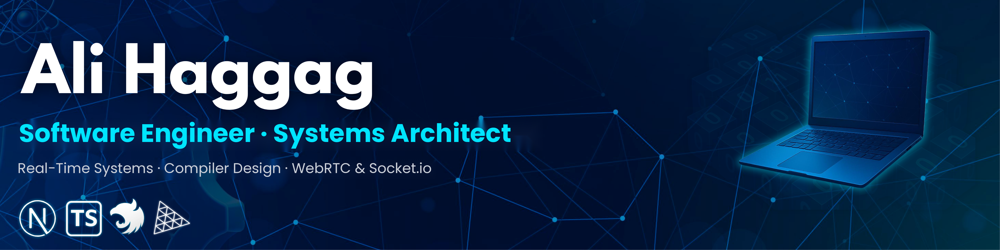

  

   

  

   

  

    
    
    
  

 

### 👨‍💻 About Me

I'm **Ali Haggag**, a Software Engineer & CS Student passionate about building **complex, scalable systems**. I specialize in the **MERN Stack** with a deep focus on **Real-time Communication** (Socket.io & WebRTC) and **AI Integration**.

 

Currently building **[Flurry v2.0](https://github.com/Ali-Haggag7/Flurry-app)** (Social Super App) 🔭
 
Core Strength: **System Design, Performance Optimization, and Clean Architecture** ⚡
 
Always exploring new tech: Currently diving deep into **Microservices** 🌱

 

  
### 🛠️ Technical Arsenal

| **Category** | **Technologies** |
| :--- | :--- |
| **Frontend & Next.js** |  |
| **Backend & Cloud** |  |
| **Real-time & AI** |    |
| **CS & Tools** |  |

 

  
### 📊 GitHub Stats

  
  &nbsp;&nbsp;
  

 

  

 

  
🚀 <i>"Building complex systems with clean code."</i>

